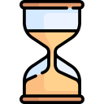

# ⏱️ TimeSession

TimeSession es una extensión para Chrome que te ayuda a gestionar y registrar el tiempo que dedicas a tus tareas, clientes y descansos, detectando automáticamente la inactividad y pausando el conteo cuando no estás usando el navegador.

## Autor

### 👨‍💻 **Iván Bazaga**

🚀 Desarrollador Frontend especializado en Angular y ecosistemas 

Estudiante Intermedio con pasión por crear aplicaciones web modernas y eficientes. Este proyecto representa la aplicación práctica de conceptos avanzados.

### ☎️ Información de Contacto

| Plataforma | Enlace | Descripción |
|------------|--------|-------------|
| GitHub | [@IvBanzaga](https://github.com/IvBanzaga/) | Repositorios y proyectos de código |
| LinkedIn | [Iván Bazaga](https://www.linkedin.com/in/ivan-bazaga-gonzalez/) | Perfil profesional y networking |
| Email | [ivan.cpweb@gmail.com](mailto:ivan.cpweb@gmail.com) | Contacto directo para oportunidades |
| Portfolio | [Ivandevs.netlify.app](https://ivandevs.netlify.app/) | Showcase de proyectos y skills |
| Proyecto | [Creamiproyecto.com](https://creamiproyecto.com/) | Showcase de proyectos y skills |

### 🧰 Stack Tecnológico de Especialización

```
Frontend: Java SprinBoot • Astro • Angular 20 • TypeScript • RxJS • Bootstrap 5 • HTML5 • CSS3
Tools: Angular CLI • Git • VS Code • Prettier • Jasmine • Karma
Learning: NgRx • PWA • Node.js • Express • Mysql •  Oracle
```

---


## ✨ Características principales

- Inicio rápido de sesiones de trabajo y descansos.
- Registro de tareas por tipo (personal, cliente, aprendizaje, programación).
- Detección automática de inactividad: pausa la sesión si no hay actividad en el navegador durante el intervalo configurado.
- Modal configurable al abrir el navegador para preguntar qué vas a hacer.
- Panel de control (dashboard) para visualizar y gestionar sesiones y clientes.
- Configuración personalizable: intervalo de validación, modo oscuro, etc.


## 🛠️ Instalación y uso

1. Clona el repositorio o descarga los archivos.
2. Ve a `chrome://extensions/` y activa el modo de desarrollador.
3. Haz clic en "Cargar descomprimida" y selecciona la carpeta del proyecto.
4. Configura tus preferencias en la página de opciones.
5. ¡Empieza a registrar tu tiempo!


## 📁 Estructura del proyecto

- `manifest.json`: Manifest de la extensión.
- `js/`: Scripts principales (background, content, popup, dashboard, validación, librerías).
- `css/`: Estilos para las distintas vistas.
- `html/`: Archivos HTML para opciones, dashboard y popup.
- `img/`: Iconos de la extensión.


## 🖼️ Iconos

La extensión incluye los siguientes iconos en la carpeta `img/`:

| Icono      | Tamaño   | Imagen |
|------------|----------|--------|
| icon16.png | 16x16    |  |
| icon24.png | 24x24    |  |
| icon32.png | 32x32    |  |
| icon48.png | 48x48    |  |
| icon64.png | 64x64    |  |
| icon128.png| 128x128  |  |

Puedes personalizar los iconos editando los archivos en la carpeta `img/`.


## 🚦 Detección de inactividad

La extensión detecta la inactividad del usuario mediante eventos de interacción (mouse, teclado, scroll, etc.). Si no hay actividad durante el intervalo configurado, la sesión activa se pausa automáticamente.


## 🤝 Contribuir

¡Las contribuciones son bienvenidas! Puedes abrir issues o enviar pull requests para mejorar la funcionalidad, corregir errores o proponer nuevas características.


## 📄 Licencia

Este proyecto está bajo la licencia MIT.
